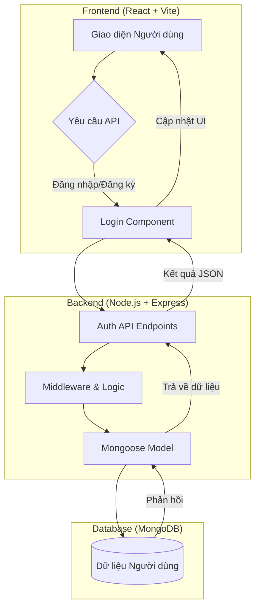

# AI Journal - Ứng dụng Nhật ký Thông minh

AI Journal là một ứng dụng nhật ký hiện đại, hỗ trợ đa ngôn ngữ, chế độ tối/sáng và hệ thống xác thực người dùng an toàn. Dự án được xây dựng với kiến trúc Fullstack hiện đại, sẵn sàng cho việc triển khai thực tế.

## Tính năng chính
- **Xác thực người dùng**: Đăng ký, đăng nhập bảo mật với mã hóa mật khẩu.
- **Đa ngôn ngữ**: Hỗ trợ đầy đủ tiếng Việt và tiếng Anh.
- **Giao diện hiện đại**: Thiết kế phong cách Glassmorphism, hỗ trợ Dark Mode.
- **Quản lý nhật ký**: Giao diện trực quan với các mục Tổng quan, Xu hướng và 

## Kiến trúc Hệ thống & Luồng hoạt động



## Công nghệ sử dụng
- **Frontend**: React 19, Tailwind CSS, Vite.
- **Backend**: Node.js, Express.js.
- **Database**: MongoDB (Mongoose).
- **Bảo mật**: Bcryptjs (Hash password), JSON Web Token (JWT).

## 

1. **Cài đặt thư viện**:
   ```bash
   npm run install:all
   ```

2. **Chạy ở chế độ Phát triển (Dev)**:
   - Terminal 1: `cd backend && node server.js`
   - Terminal 2: `cd react-web-app && npm run dev`

3. **Chạy ở chế độ Thực tế (Production)**:
   ```bash
   npm run build
   npm start
   ```

---
Dự án được thực hiện bởi Nguyễn Hồng Phúc - VKU - 22IT.B160 trong khuôn khổ **Thực tập tốt nghiệp**.
